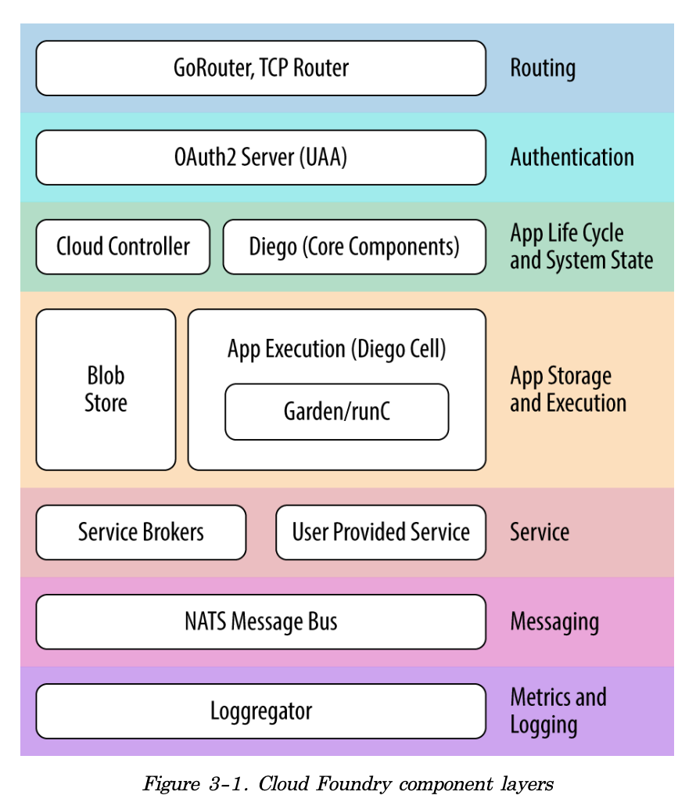

# Cloud Foundry The Definitive Guide - *Translation to Korean*

## Ch 1 - The Cloud-Native Platform
## Ch 2 - Concepts
## Ch 3 - Components

### User Management and UAA

### The Cloud Controller

> #### System State

> #### The Cloud Controller Blobstore

### The CCDB

### The Application Life-Cycle Policy

### Continuous Delivery Pipelines
- Concourse.ci

###  Application Execution
- application 실행 과 task 실행을 담당하는 구성요소 = Diego, Garden , runC

###  Diego
- the Container runtime architecture for CF
- provides the scheduling, orchestration, and placement of application and tasks

###  Garden and runC
1. Garden (a container management API: Go로 작성됨)
2. runC (OCI compatible backend container implementation)
    - Docker 같은 container runtime 임
    - OCI: Open Container Initiative: 
        + https://github.com/opencontainers/runtime-spec/blob/master/runtime.md

### Metrics and Logging
### Metron Agent
- Cell로부터 application logs 를 모은다 (gathering)
    * Cell = CF Diego host
- application logs 와 component metrics를 Loggregator subsystem으로 포워딩한다 (forwarding)

### Loggregator (log aggregator)
- Firehose
    1. 파이어호스를 통해서 application logs, container metrics (memory, CPU, and disk-per-app instance), component counter/HTTP events 에 접근할 수 있음 (component logs 는 제공안함)
    2. Component logs는 rsyslog drain 을 통해서 검색할 수 있음

### Messaging
### Additional Components
> #### Stacks
- prebuilt root filesystem (rootfs)
- 스택은 droplet과 함께 사용된다 (droplet: the output of buildpack staging)
- 스택은 애플리케이션 실행을 위해 사용되는 container filesystem을 제공함

> #### A marketplace of On-Demand Services
- CF는 마켓플레이스 개념을 가지고 있다
- 애플리케이션은 자주 외부 서비스에 의지한다 (databases, caches, messaging engines, third-party APIs)
- CF marketplace는 플랫폼 확장 포인트이다
    1. 개발자들은 실행중인 애플리케이션을 지원하기 위해 서비스들을 마켓플레이스에서 사용할 수 있다
- 플랫폼 운영자는 service brokers, route services user-provided services 를 통해서 추가적인 서비스들을 마켓플레이스에 추가할 수 있다
    1. 마켓플레이스는 CF 사용자에게 셀프서비스, 추가 서비스 인스턴스의 주문형 프로비저닝을 제공한다
    2. 서비스 개발자는 마켓플레이스에 플랫폼에서 실행할 수 있는 어떤 애플리케이션을 서비스 형태로 노출할 수 있다
- Service brokers
    1. 개발자들은 Service Instance를 프로비전할 수 있다. 그리고 Service Broker를 통해서 그 service instance를 애플리케이션에 바인딩할 수 있다
    2. 서비스 브로커는 CF 사용자에게 다음과 같은 것을 제공하기 위해 CAPI (CF API) 를 구현한다 (자기 서비스를 제공하고 싶은 사람이 해야 할 일)
        - List Service Offerings
        - Provision (create) and deprovision (delete) service instance
        - Enable applications to bind to, and ubind from, the service instances
    3. Provision 은 서비스 리소스를 예약하는 것. Bind 는 리소스접근에 필요한 정보를 애플리케이션에 전달하는 것
        1. Reserved resource 는 한마디로 service instance 이다
    4. The key concern is that the broker implements the required API to interact with the Cloud Controller
- User-provided services
    1. Service Broker 방식이외에도, 플랫폼 운영자는 기존 서비스들을 User-provided services 를 통해서 노출할 수 있음. customer database 를 cf application과 binding 할 수 있다는 의미  

> #### Buildpacks and Docker Images
1. cf push 배포 할 수 있는 두가지 형태
    * A standalone application
        + war/jar file or raw source code (link to a git remote)  --> 이걸 buildpack 과정이 droplet으로 만든다 (컨테이너이미지)
    * A prebuilt Docker image (that could contain additional runtime and middleware dependencies)
2. standalone application 을 cf push 하면, buildpack process 가 다음과 같은 일을 수행한다:
    * The detection of an application framework
    * The application compilation (known in cf terminology as Staging)
    * Running the application
3. 요약
    1. Buildpacks 은 개발자의 application artifact 를 가져와서 컨테이너 이미지화 시킨다. 컨테이너 이미지화 된 그것을 우리는 *__droplet__* 이라고 부른다
    2. 결국 application 을 위한 Delivery 체계는 Containerization 이다

> #### Infrastructure and Cloud Provider Interface
* __CF 설치 전에 셋팅 해야하는 내용__
    > + Networks and subnets (typically a /22 private network)
    > + VMs with specified CPU and memory requirements
    > + Storage for VMs
    > + File server or blobstore
    > + DNS, certificates, and wildcard domains
    > + Load balancer to pass traffic into the GoRouter
    > + NAT for traffic flowing back to the load balancer

* CF는 CPI (Cloud Provider Interface)를 가지고 인프라스트럭처-특수구현부분을 추상화 한다.

### The Cloud Foundry Github Repository
* https://github.com/cloudfoundry/cf-deployment  

### Summary
* __Cloud Foundry Component layers__  
  
 
* __Routing__ : GoRouter, TCPRouter, and external load balancer
* __Authentication__ and user management :  User Access and Authentication Management
* __Application__ life cycle and system state : Cloud Controller, Diego's core components (e.g., BBS and Brain)
* __App storage and execution__ : blobstore (including app artifacts/droplets and the Application Life-Cycle Binaries), Diego Cell (Garden, and runC)
* __Services__ : Service Brokers, User Provided Service)
* __Messaging__ : NATS (Network Address Translation) Messaging Bus
* __Metrics__ and logging : Loggregator (including Doppler and the Firehose)

## Ch 4 - Preparing Your Cloud Foundry Environment
> - CF 설치 전, 이해하고 있어야 하는 내용 
    > * Installation steps
    > * Non-technical considerations
    > * Cloud Foundry dependencies and integrations
    > * IaaS and infrastructure design
    > * Networking design and routing
1. Installation Steps
    1. IaaS 환경 생성 (create) 및 설정 (configure) :  networks, security groups, blobstores, load balancers
    2. 외부기업용서비스 설정 : LDAP, syslog endpoints or monitoring, metrics dashboards
    3. BOSH Director 배포하기
    4. IaaS/Infrastructe 관련한 BOSH configuration 생성 (create) : 즉, Cloud Configuration 생성
    5. Deployment manifest 생성 : CF를 배포하기 위함
    6. CF와 필요한 기업서비스들을 통합하기 : deployment manifest 를 가지고 함
    7. Cloud Foundry 배포하기
2. Non-technical Considerations
    > - The Team structure required for installing Cloud Foundry
    > - The required deployment topology of Cloud Foundry

    1. Team Structure: Platform Operations for the  Enterprise
        - 위 두가지항목은 대기업에서 꼭 고려해야할 사항이다
        - CF배포는 비즈니스 단위별로 하나씩 배포 또는 DevOps 중심의 팀이 사용할 수 있는 중앙플랫폼으로서 배포
        - 대부분의 기업들은 Centralized Platform Operations team을 구성한다
        - 어떤 형태의 팀을 구성하든지 간에, 플랫폼 운영자의 전반적인 책임은 다음과 같은 역할을 포함한다
            * Networking administrator
            * Storage administrator
            * System administrator
            * IaaS administrator
            * Software development
            * Security
            * QA and performance testing
            * Release management
            * Project management
    2. Deployment Topology 
    > How many Cloud Foundry instances should you deploy? 
        
        - A number of factors to consider when addressing this question
            * 전체회사당 하나의 인스턴스가 필요? 또는 Organization 당 하나의 인스턴스가 필요?
            * 해당 문단 다시 읽어보기
4. Cloud Foundry dependencies and integrations
    * CF dependencies
        1. 기본 디펜던시들
            * Provisioning the IaaS, Configuring a load balancer, syslog endpoints, SSO solutions, metrics dashboards
        2. 최소한의 외부 디펜던시들 (Minimum external dependencies)
            * Configured IaaS and Infrastructure env with available administrator credentials
            * Configured networking (subnets and security groups)
            * Defined storage policy and an additional NFS- or Amazon S3 - compatible blobstore (for bosh blobstore and Cloud foundry blobstore)
            * External load balancers set up to point to GoRouter IP addresses
            * DNS records set up, including defining appropriate system, app, and any other required wildcard domains along with SSL certificates
        3. 추가적인 통합 고려사항
            * SAML, LDAP, or SSO configured for use with CF where required
            * A Syslog endpoint (Splunk or ELK) to receive component syslog information
            * System monitoring and metrics dashboards (DataDog) set up to receive system metrics
            * Application performance management (APM) tool (Dynatrace, NewRelic, AppDynamics) set up for receiving application metrics) 
5. IaaS and Infrastructure design
> Through the use of the BOSH release tool chain, Cloud Foundry is designed to run on any IaaS provider that has a supported CPI

    - BOSH CPIs for the following infrastructures:
        * GCP
        * AWS
        * Azure
        * OpenStack
        * vSpehere's vCenter
        * vSphere's vCloudAir
        * Photon
        * RackHD
        * Your local machine (for deploying BOSH Lite)
    - Designing for Resilience
        * HA를 위해서 AZs 를 사용하고 싶으면, 최소 3개의 AZs가 필요함 (By Raft consensus algorithm)
        * Cloud Foundry deployment 예제를 위해서 Bosh-Bootloader 와 CF deployment를 사용
        * bosh-bootloader는 사용자를 대신해서 infrastructure를 구성하고 자동으로 3개의 AZs를 설정한다
    - Sizing and Scoping the Infrastructure
        * 
        * Sizing과 Capacity planning 은 CF 배포전의 가설과 달리 metrics 과 실제 데이터를 통해 정보를 제공, 실행하며 조치를 취해야하는 것임
        * 명확한 Sizing 보다는 Scoping 하는 걸 추천함
        * 인프라 구성과 사이징을 위한 참고자료
            + Reference architecture를 참고하여 필수 콤포넌트들을 식별 (CF components)
            + PCF sizing tool - http://pcfsizer.pivotal.io/#!/sizing/aws/2.2/small
        * 구성요소를 구성하고 예상 워크로드 (workload)를 기반으로 Sizing 수행
        * Peak load에서 application 이 어떻게 되는지 영향도 파악하기
        * 동시접속 처리를 위해 더 많은 instances가 필요 -> 추가된 instance들로 인해 Cell 리소스 추가 필요 -> 추가된 app들의 트래픽 처리량이 늘어남에 따라 동시접속 증가 -> 증가된 동시접속 처리를 위해서 GoRouter가 더 필요
    - Cell sizing
        * 제일 중요. AI 가 증가할 때 Cell 이 대부분 증가한다
        * Typical sizing for a Cell
            * 
    - Overcommitting Memory
        * Cell memory 는 8G, APP memory는 2G 라고 하면 하나의 Cell에 3개의 2G가 앱이 running 될 수 있다. 그리고, 이건 1G 메모리가 낭비된다. 결국 Cell 이 늘어나면 낭비되는 메모리도 누적된다.
        * 반대로, Cell 메모리가 엄청 크면, Chun 의 위험도가 높아진다. (Cell 장애시, 그 안의 app 들이 다른 Cell 로 이동하는 현상)
            1. 128 GB Cell 에, 512MB짜리 App이 256 개가 running 하는 상황
            2. 이 상황에, Cell 이 장애를 맞으면, CF는 한번에 순차적으로 256개 앱을 재배치 (replace) 한다. 
                * 나머지 모든 Cell이 최대 Capacity 로 실행중이면, 또 다른 Cell 이 추가 될때까지 App rescheduling 은 발생하지 않음
            3. CF 는 어쨌든 결국엔 Consistent 하기 때문에 충분한 Cell이 확보되면 다시 App 재배치를 수행함
    - Instance group replication
        * 아래 컴포넌트들은 3개의 AZs 에 모든 컴포넌트들의 복제본을 유지하는 게 좋다. (cluster 구성은 3개의 instances 가 필요: 이런 애들은 항상 홀수로 구성. 그런데, 실상은 3개보다 많은 인스턴스 구성은 별다른 이득이 없음)
            + MySQL (for BBS, UAA, and CCDBs)
            + NATS
            + Diego (BBS, Brain, AccessVM, CC-Bridge, Cells)
            + Routing (GoRouter, Consul, RouteEmitter)
            + Cloud Controller (including the CC-Worker)
            + UAA
            + Doppler server and Loggregator traffic controller
        * 위 컴포넌트 외에 다른 컴포넌트들은 최소 2개의 복제본을 가져야 한다. 
            + HA 와 Rolling Upgrade 를 위함
        * GoRouter 경우, application traffic의 크리티컬 패쓰임. 그래서 AZ 당 2개 를 고려할 필요있음
            + 만약에 하나의 AZ이 go offline 한다면, 발생하는 Peak traffic을 처리해야함.
            * 
    - Setting Up an AWS VPC
        * VPC 셋팅 전 필요한 것
            + CF 설치에 필요한 최소 리소스를 수용할 수 있는 AWS 계정
            + 적절한 Region (예: US-west)
            + user credentials 이 설정되어 있고 AWS CLI 를 가지고 있는Operator machine
            + CF installation 에 기본 20 개 인스턴스 이상이 필요. 기본요구사항을 커버할 수 있는 AWS 계정
            + Cloud Foundry deployment에 사용할 key-pair. 이것은 인스턴스의 ssh 접속설정을 위해 필요. VPC 생성시, key-pair name 은 NAT instance에 업로드 되어야 함.
            + 기본 도메인을 위한 인증서
        * Tip
            + Bosh-bootloader 를 통해 VPC setup을 시작할 수 있음.
                + 아래 표는 AWS VPC 수동 셋팅시에 고려해야하는 관련 dependencies 목록
                + 
            + Bosh-bootloader 를 사용하지 않을 경우, 아래와 같이 직접 VPC 를 셋팅해야
                + 
    - Jumpbox
        * https://github.com/cloudfoundry-community/jumpbox-boshrelease
        * 요놈을 사용하면 jumbox에 ssh 로 접속하지 않고, SOCKS5 프로토콜을 통해 나의 workstation 의 로컬포트를 통해서 CLI 를 실행할 수 있음. (???
6. Networking design and routing
> 본인의 Data Center 내의 IP 와 Cloud Foundry에서 예약되어 있는 IP 와 충돌을 피해야하는 점이 중요  

    * 
    * Best Practice:  Cloud Foundry와 분리된 네트워크에 서비스들을 함께 배치하고 이 두 세그먼트간에 양방향 통신을 허용하는 것이 쵝오
    * App Request Flow - https://blog.altoros.com/cloud-foundry-security-achieving-pci-dss-compliance.html

    - Using Static IPs
        * Cloud Foundry components = instance groups: BOSH 세계에서는 instance groups 라고 칭함)
            * 이 녀석들은 static IP 가 필요하거나 DNS 가 필요함. 아래와 같은 놈들임.
                * Load balancer (static IP for HAProxy, VIP for F5, etc.)
                * GoRouter (depending on the IaaS, some CPIs will resolve this for you)
                * NATS
                * Consul/etcd
                * Database such as a MySQL cluster (RDS referenced by DNS)
            * Consul의 Internal DNS resolution을 통해서 IP 획득하는 CF instance groups (내부 IP로 접근되는 CF 컴포넌트s)
                * Diego components (BBS, Brain, etc.)
                * Cloud Controller
                * Cell
                * GoRouter (depending on the IaaS, some CPIs will resolve this for you)
                * Routing API
                * Loggregator
                * WeDAV, nfs_server (or S3 blobstore referenced by DNS)
                * etcd
            * 정리: CF components 는 외부DNS resolution (IP정보획득)을 통해 접근하거나, Consul을 통한 내부 DNS resolution 을 통해 접근할 수 있다. 
    - Subnets
        * public subnet 경우 -> NAT 없는 Internet GW 가 필요
            * 모든 VM 은 public IP 가 필요하게 됨. (인터넷 접근이 필요한 VM 경우)
        * private subnet 경우 -> NAT gateway 또는 NAT Instance 가 필요
        * 일반적인 서브네팅 (subnetting) 패턴 
            * BOSH Director 와 jumpbox 를 위한 관리 서브넷 (management subnet)
            * Core Cloud Foundry Components 를 위한 전용 서브넷 (dedicated subnet)
            * IPSec 사용을 필요로 하는 서비스들을 위한 전용 IPSec 서브넷 (dedicated Internet Protocol security subnet)
            * IPSec 을 사용하지 않는 서비스들을 위한 전용 서브넷 (dedicated subnet for services without using IPSec)
            * 
    - Security Groups
    - Setting Up the Load Balancer
    - Setting Up Domains and Certificates
        * CF 는 기본도메인으로 Registered  wild card domain 이 필요
        * SSL certificate 하고 Cloud Controller 를 설정할 때 위 도메인이 필요
            * In AWS, Server Certificate 생성하기
        * Single Cloud Foundry 셋업할 경우
            * 최소 2개의 default wildcard domains 보유를 추천
                * *.system.cf.com (샘플)
                * *.apps.cf.com (샘플)
        * route 충돌 문제가 있으니 주의를 기울여야한다. (Route Collision)
            * 개발자가 배포한 앱과 cloud foundry 의 내부 콤포넌트 (system application) 을 호출하는 서브도메인이 개발자가 부여하는 route 이름 (서브도메인)에 따라 충돌할 수 있다.
            * 그래서 위 도메인 처럼 default system 관련 도메인과 default app 관련 도메인을 보유하여 관리하는걸 추천
        * Cloud Foundry Domains 위한 SSL 인증서 필요
            * 테스트용 또는 개발용으로는 self-signed certificate 를 사용가능.
            * PROD에서는 CA에서 구입한 인증서 사용필요. (CA: certificate authority)
            * 가장 손쉬운 방법: AWS Certificate Manager 활용하기 (무료!)
                * ELB 사용 전제임.
            * bosh-bootloader 이용해서 AWS key 와 certificate 를 생성 및 업로드 할 수 있음.
            * bosh-bootloader 를 이용하지 않을 경우
                * openssl 사용하여 certificate (인증서) 생성한다.
                    * $ openssl req -sha256 -new -key <YOUR_KEY.pem> -out <YOUR_KEY_csr.pem> 
                    * $ openssl x509 -req -days 365 -in <YOUR_KEY_csr.pem>
                * 수동으로 aws key를 추가하고 vpc 로 certificate를 업로드한다.
                    * $ aws iam upload-server-certificate --server-certificate-name <YOUR_CERT_NAME> \ --certificate-body file://<YOUR_CERT.pem> \ --private-key file://<YOUR_KEY.pem>
            * 마지막으로, Route53에서 ELB를 가리키는 도메인 네임을 등록하기~
7. Summary
    - Cloud Foundry 는 배포하기 전에 심사숙고가 필요한 복잡한 분산 시스템
    - 효율적인 노력과 측정은 미래자원 경합 또는 인프라스트럭처 그리고 구성요소 실패와 같은 도전적인 일들을 완화시킨다.
"""
"""
    1. Concourse.ci 같은 CI pipeline 을 사용하면 Deployment 와 Configuration은 엄청 쉬워짐
    2. preproduction 과 production 인스턴스의 분리
    3. Deployment 샘플 -  https://content.pivotal.io/blog/uk-charity-raises-record-donations-powered-by-cloud-foundry
    4. pivotal cf 관련 이야기
    5. Diego는 app replacement 와 container life cycle 을 담당하는 서브시스템
    6. bosh-bootloader 는 key-pair를 생성해줌

## Ch5 - Installing and Configuring Cloud Foundry
## Ch 6 - Diego
## Ch 7 - Routing Considerations
## Ch 8 - Containers, Containers, Containers
## Ch 9 - Buildpacks and Docker
## Ch 10 - BOSH Concepts
## Ch 11 - BOSH Releases
## Ch 12 - BOSH Deployments
## Ch 13 - BOSH Components and Commands
## Ch 14 - Debugging Cloud Foundry
## Ch 15 - User Account and Authentication Management
## Ch 16 - Designing for Resilience, Planning for Disaster
## Ch 17 - Cloud Foundry Roadmap

