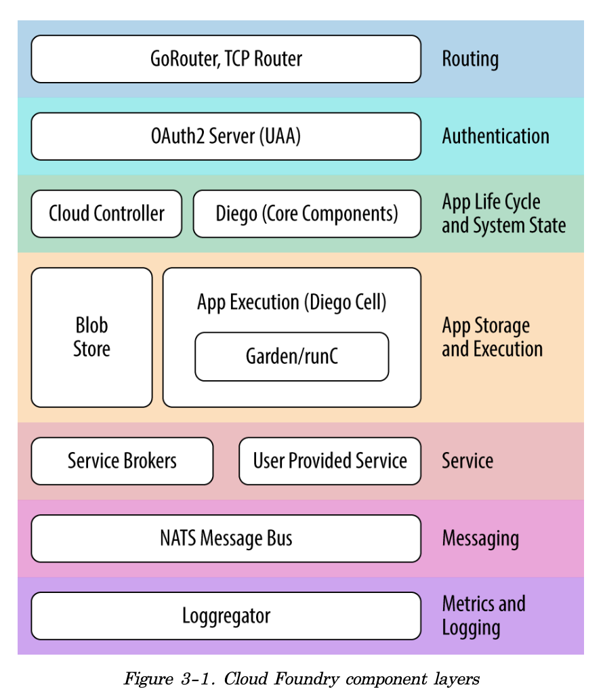
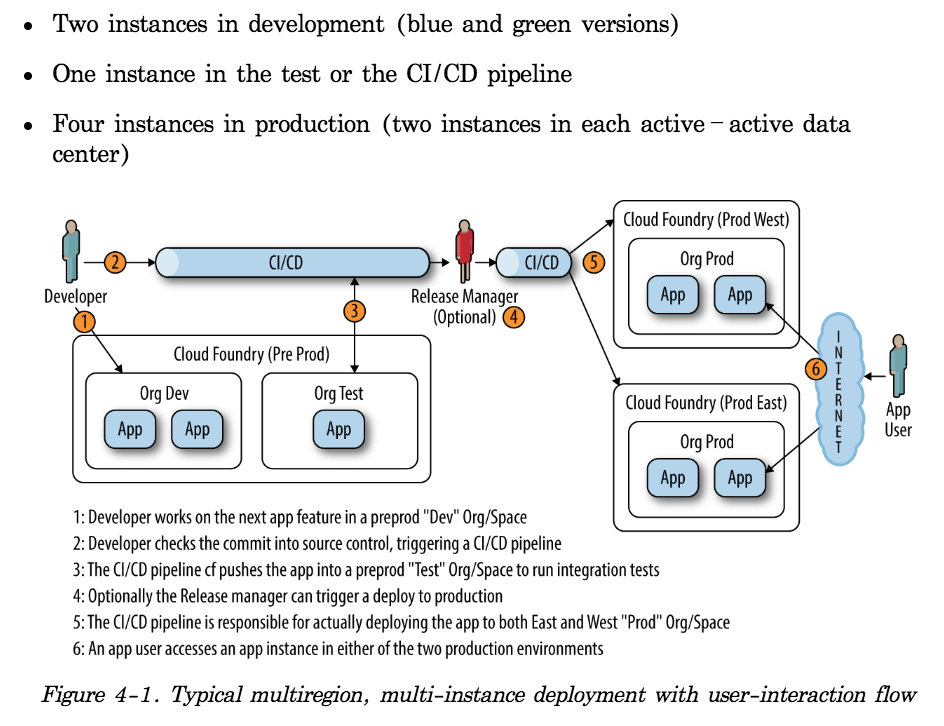
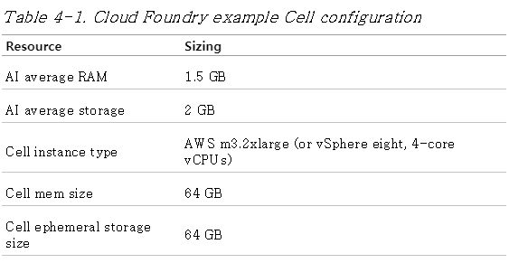
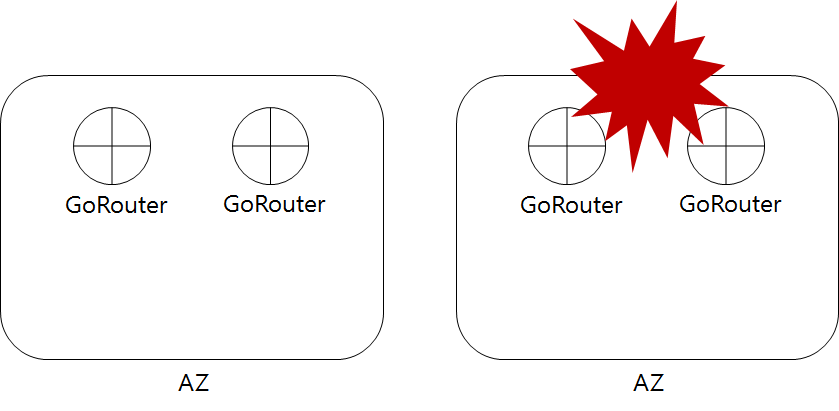
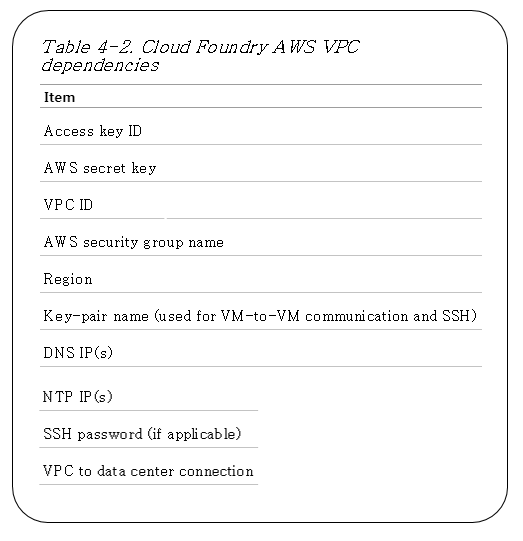
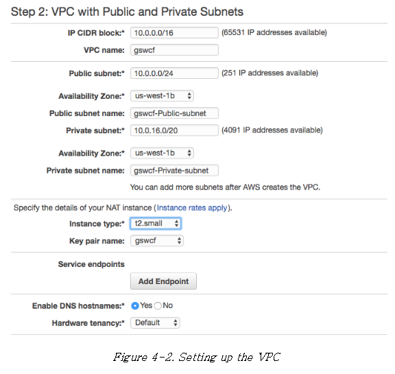
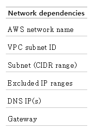
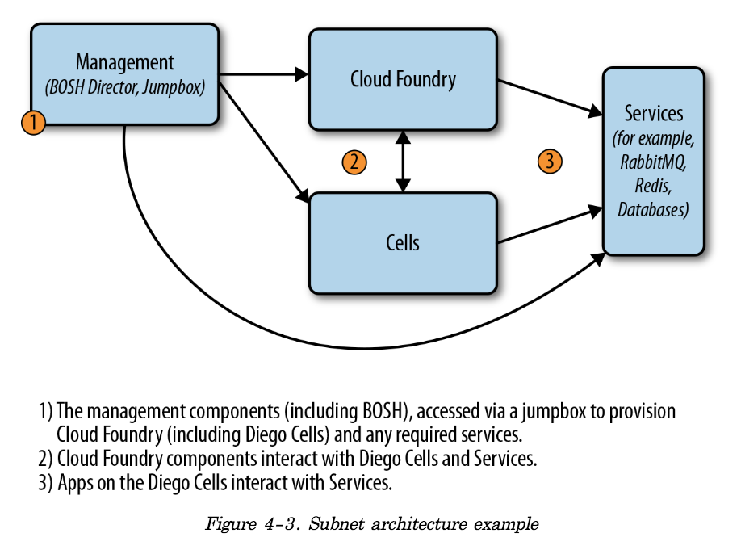

# Cloud Foundry The Definitive Guide - *Translation to Korean*


[1.개발을 하고 싶어요](##-Components-Overview)

# _Ch 1 - The Cloud-Native Platform_
# _Ch 2 - Concepts_
# _Ch 3 - Components_
## Components Overview

## Routing via the Load Balancer and GoRouter

## User Management and UAA

## The Cloud Controller

> ### System State

> ### The Cloud Controller Blobstore

* The CCDB

* The Application Life-Cycle Policy

* Continuous Delivery Pipelines
    + Concourse.ci

##  Application Execution
* application 실행 과 task 실행을 담당하는 구성요소 = Diego, Garden , runC

###  Diego
* the Container runtime architecture for CF
* provides the scheduling, orchestration, and placement of application and tasks

###  Garden and runC
1. Garden (a container management API: Go로 작성됨)
2. runC (OCI compatible backend container implementation)
    - Docker 같은 container runtime 임
    - OCI: Open Container Initiative: 
        + https://github.com/opencontainers/runtime-spec/blob/master/runtime.md

## Metrics and Logging
### Metron Agent
- Cell로부터 application logs 를 모은다 (gathering)
    * Cell = CF Diego host
- application logs 와 component metrics를 Loggregator subsystem으로 포워딩한다 (forwarding)

### Loggregator (log aggregator)
- Firehose
    1. 파이어호스를 통해서 application logs, container metrics (memory, CPU, and disk-per-app instance), component counter/HTTP events 에 접근할 수 있음 (component logs 는 제공안함)
    2. Component logs는 rsyslog drain 을 통해서 검색할 수 있음

## Messaging
## Additional Components
### Stacks
- prebuilt root filesystem (rootfs)
- 스택은 droplet과 함께 사용된다 (droplet: the output of buildpack staging)
- 스택은 애플리케이션 실행을 위해 사용되는 container filesystem을 제공함

### A marketplace of On-Demand Services
- CF는 마켓플레이스 개념을 가지고 있다
- 애플리케이션은 자주 외부 서비스에 의지한다 (databases, caches, messaging engines, third-party APIs)
- CF marketplace는 플랫폼 확장 포인트이다
    1. 개발자들은 실행중인 애플리케이션을 지원하기 위해 서비스들을 마켓플레이스에서 사용할 수 있다
- 플랫폼 운영자는 service brokers, route services user-provided services 를 통해서 추가적인 서비스들을 마켓플레이스에 추가할 수 있다
    1. 마켓플레이스는 CF 사용자에게 셀프서비스, 추가 서비스 인스턴스의 주문형 프로비저닝을 제공한다
    2. 서비스 개발자는 마켓플레이스에 플랫폼에서 실행할 수 있는 어떤 애플리케이션을 서비스 형태로 노출할 수 있다
- Service brokers
    1. 개발자들은 Service Instance를 프로비전할 수 있다. 그리고 Service Broker를 통해서 그 service instance를 애플리케이션에 바인딩할 수 있다
    2. 서비스 브로커는 CF 사용자에게 다음과 같은 것을 제공하기 위해 CAPI (CF API) 를 구현한다 (자기 서비스를 제공하고 싶은 사람이 해야 할 일)
        - List Service Offerings
        - Provision (create) and deprovision (delete) service instance
        - Enable applications to bind to, and ubind from, the service instances
    3. Provision 은 서비스 리소스를 예약하는 것. Bind 는 리소스접근에 필요한 정보를 애플리케이션에 전달하는 것
        1. Reserved resource 는 한마디로 service instance 이다
    4. The key concern is that the broker implements the required API to interact with the Cloud Controller
- User-provided services
    1. Service Broker 방식이외에도, 플랫폼 운영자는 기존 서비스들을 User-provided services 를 통해서 노출할 수 있음. customer database 를 cf application과 binding 할 수 있다는 의미  

### Buildpacks and Docker Images
1. cf push 배포 할 수 있는 두가지 형태
    * A standalone application
        + war/jar file or raw source code (link to a git remote)  --> 이걸 buildpack 과정이 droplet으로 만든다 (컨테이너이미지)
    * A prebuilt Docker image (that could contain additional runtime and middleware dependencies)
2. standalone application 을 cf push 하면, buildpack process 가 다음과 같은 일을 수행한다:
    * The detection of an application framework
    * The application compilation (known in cf terminology as Staging)
    * Running the application
3. 요약
    1. Buildpacks 은 개발자의 application artifact 를 가져와서 컨테이너 이미지화 시킨다. 컨테이너 이미지화 된 그것을 우리는 *__droplet__* 이라고 부른다
    2. 결국 application 을 위한 Delivery 체계는 Containerization 이다

### Infrastructure and Cloud Provider Interface
- __CF 설치 전에 셋팅 해야하는 내용__
    > + Networks and subnets (typically a /22 private network)
    > + VMs with specified CPU and memory requirements
    > + Storage for VMs
    > + File server or blobstore
    > + DNS, certificates, and wildcard domains
    > + Load balancer to pass traffic into the GoRouter
    > + NAT for traffic flowing back to the load balancer

* CF는 CPI (Cloud Provider Interface)를 가지고 인프라스트럭처-특수구현부분을 추상화 한다.

## The Cloud Foundry Github Repository
* https://github.com/cloudfoundry/cf-deployment  

## Summary
- __Cloud Foundry Component layers__  
  
 
- __Routing__ : GoRouter, TCPRouter, and external load balancer
- __Authentication__ and user management :  User Access and Authentication Management
- __Application__ life cycle and system state : Cloud Controller, Diego's core components (e.g., BBS and Brain)
- __App storage and execution__ : blobstore (including app artifacts/droplets and the Application Life-Cycle Binaries), Diego Cell (Garden, and runC)
- __Services__ : Service Brokers, User Provided Service)
- __Messaging__ : NATS (Network Address Translation) Messaging Bus
- __Metrics__ and logging : Loggregator (including Doppler and the Firehose)

# _Ch 4 - Preparing Your Cloud Foundry Environment_
- __CF 설치 전, 이해하고 있어야 하는 내용__  
    > * Installation steps
    > * Non-technical considerations
    > * Cloud Foundry dependencies and integrations
    > * IaaS and infrastructure design
    > * Networking design and routing 

## Installation Steps
1. IaaS 환경 생성 (create) 및 설정 (configure) :  networks, security groups, blobstores, load balancers
2. 외부기업용서비스 설정 : LDAP, syslog endpoints or monitoring, metrics dashboards
3. BOSH Director 배포하기
4. IaaS/Infrastructe 관련한 BOSH configuration 생성 (create) : 즉, Cloud Configuration 생성
5. Deployment manifest 생성 : CF를 배포하기 위함
6. CF와 필요한 기업서비스들을 통합하기 : deployment manifest 를 가지고 함
7. Cloud Foundry 배포하기

## Non-technical Considerations
- The Team structure required for installing Cloud Foundry
- The required deployment topology of Cloud Foundry

### Team Structure: Platform Operations for the  Enterprise
- 위 두가지항목은 대기업에서 꼭 고려해야할 사항이다
- CF배포는 비즈니스 단위별로 하나씩 배포 또는 DevOps 중심의 팀이 사용할 수 있는 중앙플랫폼으로서 배포
- 대부분의 기업들은 Centralized Platform Operations team을 구성한다
- 어떤 형태의 팀을 구성하든지 간에, 플랫폼 운영자의 전반적인 책임은 다음과 같은 역할을 포함한다
    * Networking administrator
    * Storage administrator
    * System administrator
    * IaaS administrator
    * Software development
    * Security
    * QA and performance testing
    * Release management
    * Project management
    
### Deployment Topology
* How many Cloud Foundry instances should you deploy? 

* A number of factors to consider when addressing this question
    + 전체회사 당 하나의 인스턴스가 필요? 또는 Organization 당 하나의 인스턴스가 필요?
    + 해당 문단 다시 읽어보기

## Cloud Foundry dependencies and integrations
* CF dependencies
    1. 기본 디펜던시들
        * Provisioning the IaaS, Configuring a load balancer, syslog endpoints, SSO solutions, metrics dashboards
    2. 최소한의 외부 디펜던시들 (Minimum external dependencies)
        * Configured IaaS and Infrastructure env with available administrator credentials
        * Configured networking (subnets and security groups)
        * Defined storage policy and an additional NFS- or Amazon S3 - compatible blobstore (for bosh blobstore and Cloud foundry blobstore)
        * External load balancers set up to point to GoRouter IP addresses
        * DNS records set up, including defining appropriate system, app, and any other required wildcard domains along with SSL certificates
    3. 추가적인 통합 고려사항
        * SAML, LDAP, or SSO configured for use with CF where required
        * A Syslog endpoint (Splunk or ELK) to receive component syslog information
        * System monitoring and metrics dashboards (DataDog) set up to receive system metrics
        * Application performance management (APM) tool (Dynatrace, NewRelic, AppDynamics) set up for receiving application metrics) 

## IaaS and Infrastructure design
Through the use of the BOSH release tool chain, Cloud Foundry is designed to run on any IaaS provider that has a supported CPI

- BOSH CPIs for the following infrastructures:
    * GCP
    * AWS
    * Azure
    * OpenStack
    * vSpehere's vCenter
    * vSphere's vCloudAir
    * Photon
    * RackHD
    * Your local machine (for deploying BOSH Lite)

### Designing for Resilience
* HA를 위해서 AZs 를 사용하고 싶으면, 최소 3개의 AZs가 필요함 (By Raft consensus algorithm)
* Cloud Foundry deployment 예제를 위해서 Bosh-Bootloader 와 CF deployment를 사용
* bosh-bootloader는 사용자를 대신해서 infrastructure를 구성하고 자동으로 3개의 AZs를 설정한다

### Sizing and Scoping the Infrastructure
  

- Sizing과 Capacity planning 은 CF 배포전의 가설과 달리 metrics 과 실제 데이터를 통해 정보를 제공, 실행하며 조치를 취해야하는 것임  
- 명확한 Sizing 보다는 Scoping 하는 걸 추천함. 
- 인프라 구성과 사이징을 위한 참고자료
   + Reference architecture를 참고하여 필수 콤포넌트들을 식별 (CF components)
   + PCF sizing tool - http://pcfsizer.pivotal.io/#!/sizing/aws/2.2/small  
- 구성요소를 구성하고 예상 워크로드 (workload)를 기반으로 Sizing 수행  
- Peak load에서 application 이 어떻게 되는지 영향도 파악하기  
- 동시접속 처리를 위해 더 많은 instances가 필요 -> 추가된 instance들로 인해 Cell 리소스 추가 필요 -> 추가된 app들의 트래픽 처리량이 늘어남에 따라 동시접속 증가 -> 증가된 동시접속 처리를 위해서 GoRouter가 더 필요

----

* Cell sizing
    + 제일 중요. AI 가 증가할 때 Cell 이 대부분 증가한다
    + Typical sizing for a Cell
        -   

* Overcommitting Memory
    + Cell memory 는 8G, APP memory는 2G 라고 하면 하나의 Cell에 3개의 2G가 앱이 running 될 수 있다. 그리고, 이건 1G 메모리가 낭비된다. 결국 Cell 이 늘어나면 낭비되는 메모리도 누적된다.
    + 반대로, Cell 메모리가 엄청 크면, Chun 의 위험도가 높아진다. (Cell 장애시, 그 안의 app 들이 다른 Cell 로 이동하는 현상)
        1. 128 GB Cell 에, 512MB짜리 App이 256 개가 running 하는 상황
        2. 이 상황에, Cell 이 장애를 맞으면, CF는 한번에 순차적으로 256개 앱을 재배치 (replace) 한다. 
            - 나머지 모든 Cell이 최대 Capacity 로 실행중이면, 또 다른 Cell 이 추가 될때까지 App rescheduling 은 발생하지 않음
        3. CF 는 어쨌든 결국엔 Consistent 하기 때문에 충분한 Cell이 확보되면 다시 App 재배치를 수행함
* Instance group replication
    + 아래 컴포넌트들은 3개의 AZs 에 모든 컴포넌트들의 복제본을 유지하는 게 좋다. (cluster 구성은 3개의 instances 가 필요: 이런 애들은 항상 홀수로 구성. 그런데, 실상은 3개보다 많은 인스턴스 구성은 별다른 이득이 없음)
        - MySQL (for BBS, UAA, and CCDBs)
        - NATS
        - Diego (BBS, Brain, AccessVM, CC-Bridge, Cells)
        - Routing (GoRouter, Consul, RouteEmitter)
        - Cloud Controller (including the CC-Worker)
        - UAA
        - Doppler server and Loggregator traffic controller
    + 위 컴포넌트 외에 다른 컴포넌트들은 최소 2개의 복제본을 가져야 한다. 
        - HA 와 Rolling Upgrade 를 위함
    + GoRouter 경우, application traffic의 크리티컬 패쓰임. 그래서 AZ 당 2개 를 고려할 필요있음
        - 만약에 하나의 AZ이 go offline 한다면, 발생하는 Peak traffic을 처리해야함.
        -   
         
### Setting Up an AWS VPC
* VPC 셋팅 전 필요한 것
    + CF 설치에 필요한 최소 리소스를 수용할 수 있는 AWS 계정
    + 적절한 Region (예: US-west)
    + user credentials 이 설정되어 있고 AWS CLI 를 가지고 있는Operator machine
    + CF installation 에 기본 20 개 인스턴스 이상이 필요. 기본요구사항을 커버할 수 있는 AWS 계정
    + Cloud Foundry deployment에 사용할 key-pair. 이것은 인스턴스의 ssh 접속설정을 위해 필요. VPC 생성시, key-pair name 은 NAT instance에 업로드 되어야 함.
    + 기본 도메인을 위한 인증서
* Tip
    + Bosh-bootloader 를 통해 VPC setup을 시작할 수 있음.
        - 아래 표는 AWS VPC 수동 셋팅시에 고려해야하는 관련 dependencies 목록
        -   
    + Bosh-bootloader 를 사용하지 않을 경우, 아래와 같이 직접 VPC 를 셋팅해야 함
        -   

### Jumpbox
* https://github.com/cloudfoundry-community/jumpbox-boshrelease
* 요놈을 사용하면 jumbox에 ssh 로 접속하지 않고, SOCKS5 프로토콜을 통해 나의 workstation 의 로컬포트를 통해서 CLI 를 실행할 수 있음. (???

## Networking design and routing
본인의 Data Center 내의 IP 와 Cloud Foundry에서 예약되어 있는 IP 와 충돌을 피해야하는 점이 중요  

*   
* Best Practice:  Cloud Foundry와 분리된 네트워크에 서비스들을 함께 배치하고 이 두 세그먼트간에 양방향 통신을 허용하는 것이 쵝오
* App Request Flow - https://blog.altoros.com/cloud-foundry-security-achieving-pci-dss-compliance.html

### Using Static IPs
* Cloud Foundry components = instance groups: BOSH 세계에서는 instance groups 라고 칭함)
    + 이 녀석들은 static IP 가 필요하거나 DNS 가 필요함. 아래와 같은 놈들임.
        - Load balancer (static IP for HAProxy, VIP for F5, etc.)
        - GoRouter (depending on the IaaS, some CPIs will resolve this for you)
        - NATS
        - Consul/etcd
        - Database such as a MySQL cluster (RDS referenced by DNS)
    + Consul의 Internal DNS resolution을 통해서 IP 획득하는 CF instance groups (내부 IP로 접근되는 CF 컴포넌트s)
        - Diego components (BBS, Brain, etc.)
        - Cloud Controller
        - Cell
        - GoRouter (depending on the IaaS, some CPIs will resolve this for you)
        - Routing API
        - Loggregator
        - WeDAV, nfs_server (or S3 blobstore referenced by DNS)
        - etcd
    + 정리: CF components 는 외부DNS resolution (IP정보획득)을 통해 접근하거나, Consul을 통한 내부 DNS resolution 을 통해 접근할 수 있다. 

### Subnets
* public subnet 경우 -> NAT 없는 Internet GW 가 필요
    * 모든 VM 은 public IP 가 필요하게 됨. (인터넷 접근이 필요한 VM 경우)
* private subnet 경우 -> NAT gateway 또는 NAT Instance 가 필요
* 일반적인 서브네팅 (subnetting) 패턴 
    * BOSH Director 와 jumpbox 를 위한 관리 서브넷 (management subnet)
    * Core Cloud Foundry Components 를 위한 전용 서브넷 (dedicated subnet)
    * IPSec 사용을 필요로 하는 서비스들을 위한 전용 IPSec 서브넷 (dedicated Internet Protocol security subnet)
    * IPSec 을 사용하지 않는 서비스들을 위한 전용 서브넷 (dedicated subnet for services without using IPSec)
    *   

### Security Groups

### Setting Up the Load Balancer

### Setting Up Domains and Certificates
* CF 는 기본도메인으로 Registered  wild card domain 이 필요
* SSL certificate 하고 Cloud Controller 를 설정할 때 위 도메인이 필요
    + In AWS, Server Certificate 생성하기
* Single Cloud Foundry 셋업할 경우
    + 최소 2개의 default wildcard domains 보유를 추천
        - *.system.cf.com (샘플)
        - *.apps.cf.com (샘플)
* route 충돌 문제가 있으니 주의를 기울여야한다. (Route Collision)
    + 개발자가 배포한 앱과 cloud foundry 의 내부 콤포넌트 (system application) 을 호출하는 서브도메인이 개발자가 부여하는 route 이름 (서브도메인)에 따라 충돌할 수 있다.
    + 그래서 위 도메인 처럼 default system 관련 도메인과 default app 관련 도메인을 보유하여 관리하는걸 추천
* Cloud Foundry Domains 위한 SSL 인증서 필요
    + 테스트용 또는 개발용으로는 self-signed certificate 를 사용가능.
    + PROD에서는 CA에서 구입한 인증서 사용필요. (CA: certificate authority)
    + 가장 손쉬운 방법: AWS Certificate Manager 활용하기 (무료!)
        - ELB 사용 전제임.
    + bosh-bootloader 이용해서 AWS key 와 certificate 를 생성 및 업로드 할 수 있음.
    + bosh-bootloader 를 이용하지 않을 경우
        - openssl 사용하여 certificate (인증서) 생성한다.
            = $ openssl req -sha256 -new -key <YOUR_KEY.pem> -out <YOUR_KEY_csr.pem> 
            = $ openssl x509 -req -days 365 -in <YOUR_KEY_csr.pem>
        - 수동으로 aws key를 추가하고 vpc 로 certificate를 업로드한다.
            = $ aws iam upload-server-certificate --server-certificate-name <YOUR_CERT_NAME> \ --certificate-body file://<YOUR_CERT.pem> \ --private-key file://<YOUR_KEY.pem>
    + 마지막으로, Route53에서 ELB를 가리키는 도메인 네임을 등록하기~

## Summary
> - Cloud Foundry 는 배포하기 전에 심사숙고가 필요한 복잡한 분산 시스템
> - 효율적인 노력과 측정은 미래자원 경합 또는 인프라스트럭처 그리고 구성요소 실패와 같은 도전적인 일들을 완화시킨다.

1. Concourse.ci 같은 CI pipeline 을 사용하면 Deployment 와 Configuration은 엄청 쉬워짐
2. preproduction 과 production 인스턴스의 분리
3. Deployment 샘플 -  https://content.pivotal.io/blog/uk-charity-raises-record-donations-powered-by-cloud-foundry
4. pivotal cf 관련 이야기
5. Diego는 app replacement 와 container life cycle 을 담당하는 서브시스템
6. bosh-bootloader 는 key-pair를 생성해줌


# _Ch5 - Installing and Configuring Cloud Foundry_
CF 배포방법은 다양함. 그럼에도 불구하고, 패턴이 있음

* Cloud Foundry 셋업의 주요 관심사와 결정사항
    * Using bosh-bootloader (bosh-bootloader 사용하기)
    * Installing Cloud Foundry (CF 설치하기)
    * Growing the platform (플랫폼 키우기)
    * Validating platform integrity in production (PROD에서 플랫폼 무결성 검증하기)
    * Logical environment structure (Orgs and Spaces) (논리적 환경구조)
    * Deploying an application (앱 배포하기)
* CF 구성요소 와 CF's release-engineering tool chain, BOSH (a recursive acronym meaning BOSH outer shell) 에 익숙하다고 가정.
* Canonical approach to bootstrapping Cloud Foundry (CF 부트스트래핑에 대한 표준 접근법)
    * 최근까지 CF 설치, Bosh에 대한 설치 및 실행에 대한 표준방법이 없었음
    * 다양한 오픈소스 방법이 있음
        * StrarkandWayne’s genesis: https://github.com/starkandwayne/genesis
    * Cloud foundry community에서 최근에 표준을 추가함
    * 
* Installation Steps
    * CF 설치 전제조건 (prerequisites for installing CF)
        1. IaaS 환경 생성 및 설정 (networks, security groups, blobstores and load balancers 포함) : bosh-bootloader이용방법이 표준방법.
        2. 필수외부 디펜던시 마련 (LDAP, syslog endpoints, monitoring and metrics dashboards)
    * 설치단계
        1. BOSH Director 배포하기 : Deploy the BOSH Director 
        2. IaaS/인프라에 특정한 BOSH 환경설정 생성하기 (such as cloud configuration) : Create an IaaS/infrastruture-specific BOSH configuration such as cloud configuration
        3. Deployment manifest 생성하기 : Create a deployment manifest to deploy Cloud Foundry
        4. 필요한 기업서비스와 cf 통합하기 : Intergrate Cloud Foundry with the required enterprise services (via the deployment manifest)
        5. Cloud Foundry 배포하기 : Deploy Cloud Foundry
* Installing Cloud Foundry
    * CF 설치를 위해서 Infrastructure (AWS) 와 BOSH Director가 필요
        * 위 두 가지 관심사항을 bosh-bootloader 를 통해서 시작 (bootstrap) 한다
    * 하나의 BOSH environment 는 Director 와 deployments 로 구성된다.
    * Director VM 은 필요한 모든 BOSH 컴포넌트를 포함하고 있음.
    * Director 시동걸기 : BOSH CLI 를 이용.
        * `bosh create-env` (명령어임)
        * 여전히 vac, subnets, security groups, ELB, databases, blobstores 등을 프로비저닝할 일들이 남아있다
    * Bosh-bootloader
        * bosh-bootloader 로 BOSH 와 필요한 IaaS 환경을 설치한다.
        * A command-line utility (for setting up CF and Concouse on an IaaS)
        * BOSH Director 셋업하기 위해 BOSH CLI 를 사용
        * 사용 전에 확인필요 사항
            1. 디렉토리 생성 및 이동하기
                `$ mkdir bosh-bootloader; cd bosh-bootloader`
            2. 최신 안정 버전의 release 를 다운로드하고 release 를  PATH 에 존재하는 디렉토리에 추가하기
                ```
                $ wget https://github.com/cloudfoundry/bosh-bootloader/releases/download/v2.3.0/bbl-v2.3.0_osx 
                $ chmod +x bbl-v2.3.0_osx 
                $ mv bbl-v2.3.0_osx /usr/local/bin/bbl
                ```
            3. AWS user에 inline policy를 추가하기
            4. 필요한 환경변수들을 export 하기
                ```
                $ export BBL_AWS_ACCESS_KEY_ID=<YOUR ACCESS KEY>
                $ export BBL_AWS_SECRET_ACCESS_KEY=<YOUR SECRET KEY> 
                $ export BBL_AWS_REGION=<YOUR AWS DEPLOYMENT REGION>
                ```
        * 본격적으로 Bosh-bootloader 사용하기
            1. AWS VPC 셋업 및 BOSH Director 배포하기
                * `$ bbl up`
                * BOSH 최신 버전 사용하는지 항상 확인하고 BOSH environment를 업데이트하는 걸 추천 (여기서는 BOSH 2.0)
            2. Director IP, ca-cert, username and password를  bbl CLI 로 부터 가져온다. 그리고 BOSH Director 에 log in 하기
                * BOSH v2 CLI 는 HTTPS 로 Director에  연결하기 때문에 ca-cert 가 필요함.
                * 일반적으로 BOSH environment (Director IP address) 에 별명 (alias) 을 붙여 log in 한다.
                    ```
                    $ bosh alias-env my-bosh -e <YOUR-BOSH-IP> Using environment '<YOUR-BOSH-IP>' as user 'user-********'
                    $ bosh -e my-bosh --ca-cert <(bbl director-ca-cert) \ login --user $(bbl director-username) --password $(bbl director-password)
                    ```
                * 또는 환경변수 이용한 방법도 있음
                    ```
                    $ export BOSH_CLIENT=$(bbl director-username) 
                    $ export BOSH_CLIENT_SECRET=$(bbl director-password) 
                    $ export BOSH_ENVIRONMENT=$(bbl director-address) 
                    $ export BOSH_CA_CERT=$(bbl director-ca-cert) 
                    
                    # check if the above environment is set up correctly 
                    $ $ bosh env 
                    
                    # At this point you can login to your BOSH Director 
                    $ bosh login
                    ```
                * BOSH 에 처음 log in 할 때 credentials 제공하면 된다.
                * bbl 쿼리 명령이 작동하려면 bbl-state.json 파일과 동일한 디렉토리에 있어야함. bbl-state.json은 bbl up 을 처음 실행한 디렉토리에 생성됨.
            3. ELB 생성하기 (with key and certificate)
                * `$ bbl create-lbs --type cf --cert <YOUR-cert.pem> --key <YOUR-KEY.pem>`
                * cf-deployment는 소프트웨어 패키지 세트이고, git repository 에서 가져올 수 있다. 그리고, 이 패키지들은 BOSH deployment process 의 일부분으로써, 소스로부터 자동으로 컴파일된다. BOSH 는 배포 프로세스의 일부로 패키지들을 컴파일하기 위해 분리된, 임시 VM 들을 마련하고 후속 배포를 위해 자동으로 결과를 저장한다. 이런 vm을 Compilation VM 이라고 한다.
                * cloud foundry 설치시작 전에 BOSH v2 CLI 최신버전인지를 체크하자 - http://bosh.io 
            4. Stemcell 업로드하기
                * BOSH는 All OS dependencies 를 하나의 image 로 캡쳐하는 방법을 제공. 이 이미지를 stemcell 이라고 함.
                * Stemcell 업로드 하기 (각자의 IaaS 환경에 맞춰)
                    `$ bosh -e my-bosh upload-stemcell \ https://bosh.io/d/stemcells/bosh-aws-xen-hvm-ubuntu-trusty-go_agent`
            5. Cloud Foundry 배포 (deploy) 하기
                * cf-deployment git repo에서 CF 배포를 위한 표준 manifest를 얻을 수 있다. 이걸 활용.
                * `$ bosh -e my-env -d cf deploy cf-deployment/cf-deployment.yml --vars-store env-repo/deployment-vars.yml -v system_domain=<YOUR-CFDomain.com>`
                * cf-deployment.yml 은 2가지 파라미터 를 더 사용한다.
                    * System domain: 특정환경 관련 데이터이쥬
                    * 민감한 설정 정보 (credentials)
                        * Optioin filelds 를 사용하여 모든 다른 설정들을 전파해야함 (cf-deployment 참고)
                    * 이 데이터 세트를 가져 오기 위해 BOSH CLI는 현재 `--vars-store` 플래그를 사용합니다. 이 플래그는 .yml 파일을 읽고 해당 파일에있는 값을 추출하여 cf-deployment가 나타내는 템플릿을 채 웁니다. BOSH v2 CLI는 cf-deployment 매니페스트를 채우는 데 필요한 모든 변수가 포함 된이 .yml 파일을 생성합니다. 이전 예제의 명령에서 `--vars-store env-repo/deployment-vars.yml -v system_domain = $ SYSTEM_DOMAIN` 은 Cloud Foundry 시스템 도메인과 같은 사용자 정의 변수를 기반으로 deployment-vars.yml 파일을 생성합니다. 프로덕션 배포의 경우 var-store 대신 config-server를 사용해야합니다.
                *  
            6. 배포된 환경 체크하기
                * `$ bosh instances —ps` #view everything deployed
                * Route53 같은 곳에 도메인네임 등록했는지 꼭 확인하자
                * 
            7. Target the cf api domain and log in
                * `$ cf api api.<YOUR-CFDomain.com> —skip-ssl-validation`
            8. 로그인 하기 (via cf login)
                * `cf login`
                * 어드민 username 과 password 를 위해 아래 값을 사용해주오. (From deployment-vars.yml)
                    * user:
                * Pull uaa_scim_users_admin_name out of deployment-vars. 
                * This currently defaults to admin: password: . 
                * Pull uaa_scim_users_admin_password out of deployment-vars.yml.
                * 
            9. Changing Stacks
                * Stack
                    * a prebuilt roofs (to provide the container filesystem used for running applications)
                * Command to check fs
                    * `$ cf stacks`
                * Changing a stack and restate an application
                    * `$ cf push APPNAME -s STACKNAME`
            10. Growing the Platform
                    * Rolling upgrade를 수행하기 위해 Bosh 사용해서 cloud foundry를 재배포한다. (Redeploy)
            11. Validating Platform Integrity in Production 
                * CF 배포 후, 스모크 테스트 (Smoke tests) 와 Cloud Foundry acceptance tests (CATS) 를 수행 필수. 
                * 목적: CF 가 제대로 실행여부 확인
                * Dev 또는 PROD 환경을 변경하기 전에 테스트를 위해서 전용 SandBox 를 관리해야 함
            12. Start with a Sandbox
                1. 비즈니스측면에서 중요한 업무가 Production 인스턴스 에서 실행하기 전에, 스테이징 환경이나 샌드박스환경을 Production 환경을 변경하기전에 먼저 이용해야함
                2. 이 방법으로 플랫폼 변경사항들 (Infrastructure upgrade, stem cell change, Cloud Foundry release upgrade, buildpack change, or service upgrade) 을 적용하기 전에, PROD application을 격리공간에서 테스트 해볼 수 있게한다.
                3. Sandbox는 Prod 와 동일환경이어야 함 (containing a representation of the production apps and a mock up of the production services)
                4. Application Test 이 포함하는 내용 (An example set of application tests)
                    * ( cf push 명령사용 ) Use the cf push command to push the app 
                    * ( 앱과 필요한 서비스 묶기 ) Bind an application to a service(s) 
                    * ( 앱 시작 ) Start an app 
                    * ( 앱과 restful endpoint 연결 및 응답 점검 ) Target the app on a restful endpoint and validate the response
                    * ( 주어진 데이터 서비스에 write 하기위한 restful endpoint를 연결 ) Target the app on a restful endpoint to write to a given data service 
                    * ( Written 값을 읽기위해 restful endpoint 와 앱을 연결 ) Target the app on a restful endpoint to read the written value 
                    * ( 앱 로깅 점검위해 유니크 문자열을 생성 및 기록하기 ) Generate and log a unique string to validate application logging 
                    * ( 앱 정지 ) Stop an app 
                    * ( 앱 삭제 ) Delete an app
                5. 이런 테스트는 각각의 CF 인스턴스를 대상으로 실행하는 것이 좋음.
            13. Production Verification Testing
                * Prod 환경을 live 상태로 만들기 전에, 너의 플랫폼이 하는 행동을 테스트하자.
                    1. cf-smoke-tests : core Cloud Foundry functionality 기능이 잘 동작하는지 테스트
                    2. cf-acceptance-tests : Cloud Foundry behavior와 컴포넌트 통합을 테스트
                    3. 기존 수립되어져 있거나 사용자 정의 설정 (configuration) 을 포함하여, 너가 작성한 앱들과 서비스에 대한 custom acceptance tests 를 보유
                    4. 배포된 앱들에 대한 외부 모니터링
                * Prod에 배포 후에도, 의도치 않은 행동변화를 식별하는 것은 매우 중요. 
                * Prod에 지속적이고 주기적인 너만의 acceptance test 수행은 매우 추천. 반복 수행하다보면 새로운 문제를 찾을 수 있다.
            14. Production Configuration Validation
                * CATS 는 전역상태 변수를 수정하기 때문에, Live Production Env. 에 수행하는 것은 비추.
            15. Logical Environment Structure
                1. CF 배포 후, 다음 할 일은 IaaS Resource 를 Logica Env. 로 나누어야 한다. 각각의 팀, 상품, 사용자들이 사용할 수 있도록!!
                2. Orgs and Spaces
                    1. 사용자 관리 목적으로 그루핑 하는 방법을 제공
                    2. Orgs의 모든 구성원들은 동일 리소스 Quota Plan, Services availability, and custom domain 을 공유함
                    3. 하나의 quota는 특정 Org 내의 모든 액티버티에 적용된다.
                    4. 모든 Application 과 Service 은 하나의 Space 에 지정된다.
                    5. Space는 application development, deployment, and maintenance 를 위한 공유장소 (shared location)을 제공.
                    6. 사용자들은 특정 Space 관련 Role들을 가짐.
                    7. Orgs 는 보통 비즈니스 라인 또는 특정 프로젝트 단위로 정의
                    8. Spaces 는 두 가지 형태로 정의
                        1. 큰 조직은 Two-pizza teams 으로 쪼갬. 각각 피자 팀에 Space 할당. 이 팀들은 보통 마이크로 서비스 같은 격리된 컴포넌트를 개발함.
                        2. Pipeline 통해서 배포할 때, Dev space, Test space, Production space 로 나누어 구성하면 유용함.
                    9. 기본 Org 사용 및 Space  만들기 그리고 타겟팅하기
                        ```
                        $ cf create-space developer
                        $ cf target -o “default_org” -s “developer” (developer space 타겟팅)
                        ```
            16. Pushing Your First App
                1. 샘플 애플리케이션 다운로드
                    ```
                    $ git clone https://github.com/scottfrederick/spring-music 
                    $ cd spring-music
                    ```
                2. (아규먼트 관리 방법관련) 이 샘플은 App manifest 를 포함하고 있음. App manifest는 필요한 command line arguments 그리고 application metadata 를 정의!! 이건 앱 배포시 중요함. App manifest 안 쓰고, command line arguments 로 넘길 수 도 있음.
                    ```
                    --- applications: 
                    - name: spring-music 
                      memory: 1G 
                      random-route: true 
                      path: build/libs/spring-music.jar
                    ```
                3. Compile Code and cf push
                    ```
                    $ ./gradlew assemble 
                    $ cf push (이거 수행하면 배포된 앱에 접근할 수 있는 URL 이 반환됨)
                    ```
* Summary
    * cf-deployment 와 bosh-bootloader 를 사용해서 Cloud Foundry Installation을 수행했음. 
        * 내가 지금까지 수행했던 내용
            * BOSH Director 를 배포했음. Bosh-bootloader 를 사용해서 IaaS-specific components 를 생성했음
            * BOSH 와 cf-deployment를 사용해서 동작하는 Cloud Foundry 인스턴스를 배포했음
            * (배포한 CF를 점검) CATS smoke test 를 통해서 플랫폼 무결성 유효성 점검을 했음
            * Org 와 Space Set up 했음
            * Application push 했음


# _Ch 6 - Diego_
# _Ch 7 - Routing Considerations_
# _Ch 8 - Containers, Containers, Containers_
# _Ch 9 - Buildpacks and Docker_
# _Ch 10 - BOSH Concepts_
# _Ch 11 - BOSH Releases_
# _Ch 12 - BOSH Deployments_
# _Ch 13 - BOSH Components and Commands_
# _Ch 14 - Debugging Cloud Foundry_
# _Ch 15 - User Account and Authentication Management_
# _Ch 16 - Designing for Resilience, Planning for Disaster_
# _Ch 17 - Cloud Foundry Roadmap_

